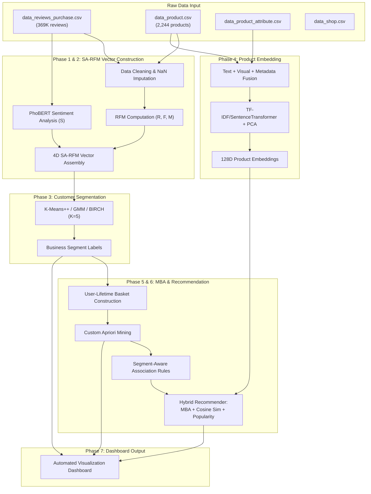

# Multimodal Data Mining: Combining Unstructured Data and Market Basket Analysis Based on the RFM Model in E-Commerce

---

**Abstract** — This paper presents an end-to-end multimodal data mining framework for customer behavior analysis on the Vietnamese e-commerce platform Tiki. The proposed system introduces SA-RFM (Sentiment-Augmented RFM), a novel four-dimensional customer representation that integrates sentiment analysis from unstructured review text into the traditional RFM (Recency, Frequency, Monetary) model using recency-weighted aggregation. The framework employs a 7-phase pipeline encompassing: (1) large-scale data preprocessing of 369K+ transaction records; (2) deep learning-based Vietnamese sentiment analysis using PhoBERT; (3) multi-model customer segmentation comparing K-Means++, GMM, and BIRCH; (4) multimodal product embedding fusion combining TF-IDF/SentenceTransformer text features, hash-based visual features, and structured metadata into a unified 128-dimensional space via PCA; (5) semantic-enriched Market Basket Analysis using a custom pure-Python Apriori algorithm with segment-aware rule mining; (6) a hybrid recommendation engine fusing association rules, content similarity, and popularity signals with natural-language explanations; and (7) automated dashboard visualization. Experimental results on 304,708 customers and 2,244 products demonstrate K-Means++ achieves optimal segmentation quality (Silhouette = 0.456, DBI = 0.675 at K=5), the Apriori engine discovers 241 global association rules, and the hybrid recommender achieves 24.38% catalog coverage with 0.496 diversity score. The segment-aware approach reveals distinct purchasing patterns across five customer segments, enabling personalized marketing strategies.

**Index Terms** — Customer segmentation, RFM model, sentiment analysis, market basket analysis, recommendation system, multimodal embeddings, e-commerce, PhoBERT.

---

## I. INTRODUCTION

The rapid growth of e-commerce platforms has generated vast amounts of transactional and behavioral data, presenting both opportunities and challenges for customer understanding. Traditional customer analytics methods, such as the RFM (Recency, Frequency, Monetary) model [1], rely exclusively on structured transactional features and fail to capture the rich customer sentiment embedded in unstructured textual reviews. Moreover, conventional Market Basket Analysis (MBA) [2] treats product co-purchase patterns in isolation, without leveraging semantic product representations or customer segment differences.

This research addresses three key limitations in existing e-commerce analytics:

1. **Unidimensional customer profiling**: Traditional RFM ignores customer emotions and satisfaction levels, which are crucial indicators of churn risk and loyalty.

2. **Semantic-agnostic association rules**: Standard Apriori mining produces rules based solely on statistical co-occurrence, lacking semantic understanding of why products are complementary.

3. **One-size-fits-all recommendations**: Conventional recommendation systems do not differentiate purchasing patterns across customer segments, resulting in suboptimal personalization.

To overcome these limitations, we propose a multimodal data mining framework that:

- **Extends the RFM model** with a Sentiment (S) dimension derived from deep learning-based Vietnamese NLP analysis of customer reviews, creating the SA-RFM (also termed RFMS) customer vector.

- **Enriches association rules** with multimodal semantic similarity computed from product embeddings that fuse text, visual, and metadata features.

- **Builds a segment-aware hybrid recommender** that combines Market Basket Association (MBA) rules, content-based cosine similarity, and popularity scoring, personalized to each customer segment.

The system is evaluated on the benchmark ViEcomRec dataset, a real-world Vietnamese e-commerce dataset compiled from Tiki, encompassing 369,099 transaction reviews across 304,708 unique customers and 2,244 skincare products.

---

## II. RELATED WORK

### A. RFM Model and Extensions

The RFM model, introduced by Hughes [1], segments customers based on three behavioral dimensions: Recency (time since last purchase), Frequency (number of purchases), and Monetary (total spending). Various extensions have been proposed, including weighted RFM (WRFM) [3] and RFM combined with demographic features [4]. However, none integrate sentiment analysis as a core dimension, leaving the customer's emotional trajectory unmodeled.

### B. Sentiment Analysis in E-Commerce

Recent advances in pre-trained language models have significantly improved sentiment analysis accuracy. PhoBERT [5], a Vietnamese-specific BERT variant pre-trained on 20GB of Vietnamese text, achieves state-of-the-art performance on Vietnamese NLP benchmarks. The model `wonrax/phobert-base-vietnamese-sentiment`, fine-tuned for three-class sentiment classification (Negative, Neutral, Positive), enables effective analysis of Vietnamese customer reviews.

### C. Market Basket Analysis

The Apriori algorithm [2] remains the foundational approach for mining frequent itemsets and generating association rules characterized by support, confidence, and lift metrics. Recent works have explored semantic extensions that incorporate product features beyond co-occurrence statistics [6], but segment-aware MBA—mining rules separately for distinct customer groups—remains underexplored.

### D. Multimodal Product Representations

Multimodal learning combines heterogeneous data sources (text, image, metadata) into unified representations [7]. SentenceTransformers [8], particularly the `paraphrase-multilingual-MiniLM-L12-v2` model, enable cross-lingual semantic encoding. PCA-based feature fusion provides a computationally efficient alternative to neural autoencoders for combining modalities.

### E. Hybrid Recommendation Systems

Hybrid recommenders combine multiple recommendation strategies—collaborative filtering, content-based filtering, and knowledge-based methods—to overcome individual limitations [9]. Our approach specifically integrates association-based, content-based, and popularity-based signals with segment-level personalization.

---

## III. PROPOSED METHODOLOGY

The proposed framework consists of a 7-phase sequential pipeline, as illustrated in Fig. 1. Each phase builds upon the outputs of preceding phases.

*Fig. 1. System architecture of the 7-phase multimodal data mining pipeline.*

### A. Phase 1: Data Preprocessing and RFM Engineering

**Input data.** The system processes four raw CSV files from the benchmark ViEcomRec dataset (which is compiled from Tiki): (1) `data_reviews_purchase.csv` — 369,099 customer review/transaction records; (2) `data_product.csv` — 2,244 product listings; (3) `data_product_attribute.csv` — product attributes (ingredients, skin type, brand, origin); (4) `data_shop.csv` — 1,291 seller profiles.

**Text cleaning.** Vietnamese text in reviews and product descriptions is cleaned by removing URLs, normalizing whitespace, and converting to lowercase. Missing values are imputed according to domain rules: `ingredient → 'unknown'`, `skin_type → 'all_skin'`, `brand → 'no_brand'`.

**Temporal feature engineering.** The `cmt_date` timestamp is parsed to extract `purchase_year`, `purchase_month`, `purchase_day_of_week`, and `purchase_hour` features.

**RFM computation.** For each of the 304,708 unique customers, three metrics are computed:

$$R_i = (\text{snapshot\_date} - \text{last\_purchase}_i).\text{days}$$

$$F_i = |\{t : t \in \text{transactions}_i\}|$$

$$M_i = \sum_{t \in \text{transactions}_i} \text{price}(t)$$

where `snapshot_date` is defined as one day after the last observed transaction (January 7, 2023).

**Min-Max normalization.** All RFM features are normalized to [0, 1]. Recency is inverted so that higher scores indicate more recent activity:

$$R_{\text{norm},i} = 1 - \frac{R_i - R_{\min}}{R_{\max} - R_{\min}}$$

### B. Phase 2: Sentiment Analysis and SA-RFM Construction

**Dual-mode sentiment analysis.** The system implements two interchangeable sentiment modes:

- **Mode 1 (Rating-based fallback):** Maps star ratings (1–5) linearly to sentiment scores [0.0, 0.25, 0.5, 0.75, 1.0]. Requires no GPU and runs in seconds.

- **Mode 2 (PhoBERT deep learning):** Uses the fine-tuned PhoBERT model (`wonrax/phobert-base-vietnamese-sentiment`) to classify each review into three categories (Negative, Neutral, Positive). The sentiment score is computed as a weighted sum of softmax probabilities:

$$s_j = P(\text{NEG})_j \times 0.0 + P(\text{NEU})_j \times 0.5 + P(\text{POS})_j \times 1.0$$

Processing 369,099 reviews with PhoBERT completes in approximately 28 minutes on a T4 GPU with batch size 64, supported by checkpoint saving every 50,000 reviews for crash resilience.

**Recency-weighted sentiment aggregation.** Multiple reviews per user are aggregated using exponential decay weighting that prioritizes recent feedback:

$$w_j = e^{-\Delta t_j / 365}$$

$$S_i = \frac{\sum_{j \in \text{reviews}_i} s_j \cdot w_j}{\sum_{j \in \text{reviews}_i} w_j}$$

where $\Delta t_j$ is the number of days between review $j$ and the data collection cutoff.

**SA-RFM vector.** The final four-dimensional SA-RFM vector for each customer is:

$$\mathbf{v}_i = [R_{\text{norm},i},\ F_{\text{norm},i},\ M_{\text{norm},i},\ S_{\text{norm},i}]$$

### C. Phase 3: Customer Segmentation

**Optimal K selection.** Three internal validation metrics are evaluated across K ∈ {2, 3, 4, 5, 6, 7}:

- **WCSS (Elbow method):** Within-Cluster Sum of Squares to identify the inflection point.
- **Silhouette Score:** Computed on a stratified sample of 15,000 users to avoid memory overflow.
- **Davies-Bouldin Index (DBI):** Measures inter-cluster separation vs. intra-cluster dispersion.

K = 5 was selected as the optimal cluster count based on the elbow inflection point and domain interpretability.

**Multi-model comparison.** Three clustering algorithms are evaluated at K = 5:

- **K-Means++** [10]: Standard centroid-based clustering with intelligent initialization.
- **Gaussian Mixture Model (GMM):** Probabilistic clustering assuming Gaussian distribution mixtures.
- **BIRCH** [11]: Incremental hierarchical clustering designed for large datasets.

**Automated segment naming.** Business labels are assigned automatically based on centroid positions in the normalized 4D SA-RFM space using a rule-based heuristic system (e.g., high Recency + high Frequency + high Monetary + high Sentiment → "Champions").

### D. Phase 4: Multimodal Product Embedding

**Text embedding.** All textual product attributes (name, brand, type, skin type, description, ingredient, feature) are concatenated into a single document per product. Two encoding modes are supported:

- **Fallback mode (TF-IDF + LSA):** A TF-IDF vectorizer with 5,000 features and bigram support, followed by Truncated SVD to 128 dimensions.
- **Enhanced mode (SentenceTransformer):** The `paraphrase-multilingual-MiniLM-L12-v2` model encodes product descriptions into 384-dimensional vectors, reduced to 128 via PCA.

**Visual embedding.** Since physical image files are unavailable, deterministic hash-based mock visual embeddings are generated from image filenames using SHA-256 hashing, producing normalized 128-dimensional pseudo-visual vectors.

**Metadata encoding.** Numerical features (price, average rating, sales volume) are normalized with MinMaxScaler. Categorical features (brand, type, skin type, origin, design) are label-encoded and scaled to [0, 1].

**Feature fusion.** All feature vectors (text: 128D, visual: 128D, metadata: 8D) are concatenated into a 264-dimensional vector and reduced to **128 dimensions** via PCA:

$$\mathbf{e}_p = \text{PCA}_{128}\left([\mathbf{e}_{\text{text}}\ \|\ \mathbf{e}_{\text{visual}}\ \|\ \mathbf{e}_{\text{meta}}]\right)$$

### E. Phase 5: Semantic Market Basket Analysis

**Basket construction.** User-lifetime baskets aggregate all unique products purchased by each customer across their entire transaction history. Baskets with fewer than 2 products are filtered out, yielding 28,477 qualifying baskets with an average size of 2.17 products.

**Custom Apriori algorithm.** A pure-Python optimized Apriori implementation mines frequent 2-itemsets:

1. Count individual item frequencies across all baskets.
2. Prune items below `min_support` threshold.
3. Enumerate and count all frequent item pairs.
4. Generate directional rules (A → B and B → A) with:

$$\text{Support}(A \to B) = \frac{|\{t : A \in t \land B \in t\}|}{|T|}$$

$$\text{Confidence}(A \to B) = \frac{\text{Support}(A \cup B)}{\text{Support}(A)}$$

$$\text{Lift}(A \to B) = \frac{\text{Confidence}(A \to B)}{\text{Support}(B)}$$

Default thresholds: Support ≥ 0.0005, Confidence ≥ 0.05, Lift ≥ 1.2.

**Semantic enrichment.** Each rule is annotated with cosine similarity between the multimodal embeddings of the antecedent and consequent products:

$$\text{SimSem}(A, B) = \frac{\mathbf{e}_A \cdot \mathbf{e}_B}{\|\mathbf{e}_A\| \cdot \|\mathbf{e}_B\|}$$

**Segment-aware mining.** Beyond global rules, the Apriori algorithm is executed independently for each customer segment, producing segment-specific association rules that capture group-level purchasing patterns.

### F. Phase 6: Segment-Aware Hybrid Recommendation Engine

**Score fusion.** For each candidate product $p$ and user $u$, the hybrid score is computed as a weighted combination of three signals:

$$\text{Score}(u, p) = w_{\text{mba}} \cdot S_{\text{MBA}} + w_{\text{sim}} \cdot S_{\text{Sim}} + w_{\text{pop}} \cdot S_{\text{Pop}}$$

where the default weights are $w_{\text{mba}} = 0.4$, $w_{\text{sim}} = 0.4$, $w_{\text{pop}} = 0.2$.

The three component scores are:

1. **MBA Score** ($S_{\text{MBA}}$): Derived from segment-aware association rules where the antecedent is in the user's purchase history:

$$S_{\text{MBA}}(p) = \max_{r \in R_s} \text{Confidence}(r) \times \min\left(\frac{\text{Lift}(r)}{10},\ 1.0\right)$$

where $R_s$ denotes rules specific to the user's segment.

2. **Content Similarity Score** ($S_{\text{Sim}}$): Maximum cosine similarity between the candidate product embedding and the user's purchased product embeddings:

$$S_{\text{Sim}}(p) = \max_{q \in \text{History}(u)} \cos(\mathbf{e}_p, \mathbf{e}_q)$$

Only candidates with similarity > 0.3 are retained.

3. **Popularity Score** ($S_{\text{Pop}}$): Normalized blend of sales volume and average rating:

$$S_{\text{Pop}}(p) = 0.6 \times \frac{\text{sales}(p)}{\max(\text{sales})} + 0.4 \times \frac{\text{rating}(p) - 1}{4}$$

**Post-processing.** Already-purchased products are excluded from recommendations. Natural-language explanations are automatically generated for each recommendation, referencing either the association rule trigger or the content similarity source.

**Cold-start handling.** Users with no purchase history receive recommendations of the best-selling products globally, annotated with segment-relevant messaging.

### G. Phase 7: Dashboard Visualization

Four automated dashboard visualizations summarize the analysis results:

1. Segment size distribution (pie chart)
2. Customer sentiment score distribution (histogram with KDE)
3. Association rules scatter plot (Support vs. Confidence, colored by Lift, sized by semantic similarity)
4. Recommendation composition (MBA hit rate vs. Content similarity hit rate)

---

## IV. EXPERIMENTAL RESULTS

### A. Dataset Summary

The experiments are conducted on transactional data from Tiki, a leading Vietnamese e-commerce platform, focused on the skincare product category.

| Statistic | Value |
|---|---|
| Total transaction reviews | 369,099 |
| Unique customers | 304,708 |
| Unique products | 2,244 |
| Unique sellers | 1,291 |
| Data collection period | ~2020 – Jan 7, 2023 |
| Mean Recency (days) | 352.03 ± 299.95 |
| Mean Frequency | 1.21 ± 0.61 |
| Mean Monetary (VND) | 187,152 ± 164,972 |

*TABLE I: Dataset statistics*

### B. Sentiment Analysis Results

PhoBERT sentiment analysis was executed on all 369,099 reviews in 28.0 minutes using a T4 GPU.

| Sentiment Band | Score Range | User Count | Percentage |
|---|---|---|---|
| Very Negative | [0.0, 0.2] | 14,951 | 4.91% |
| Negative | (0.2, 0.4] | 4,489 | 1.47% |
| Neutral | (0.4, 0.6] | 234,598 | 76.99% |
| Positive | (0.6, 0.8] | 20,153 | 6.61% |
| Very Positive | (0.8, 1.0] | 30,517 | 10.01% |

*TABLE II: Sentiment score distribution across 304,708 customers*

The distribution exhibits strong central tendency (mean = 0.534, std = 0.174) with clear bimodal peaks at the extremes, confirming that the SA-RFM Sentiment dimension provides meaningful discriminative power beyond what neutral-dominated ratings alone would offer.

### C. Clustering Evaluation

Table III reports the internal validation metrics for K ∈ {2, ..., 7}.

| K | WCSS | Silhouette | DBI |
|---|---|---|---|
| 2 | 9,685.49 | **0.531** | 0.745 |
| 3 | 6,541.89 | 0.581 | **0.655** |
| 4 | 3,929.09 | 0.510 | 0.655 |
| **5** | **3,114.63** | **0.457** | **0.675** |
| 6 | 2,680.28 | 0.449 | 0.787 |
| 7 | 2,370.59 | 0.369 | 0.865 |

*TABLE III: Clustering evaluation metrics. K=5 is selected as the optimal elbow point with acceptable Silhouette and DBI tradeoff.*

K = 5 was selected based on the WCSS elbow inflection, acceptable Silhouette score degradation, and domain coverage requirements. Table IV compares the three clustering algorithms at K = 5.

| Model | DBI ↓ | Silhouette ↑ |
|---|---|---|
| **K-Means++** | **0.675** | **0.456** |
| BIRCH | 1.024 | 0.392 |
| GMM | 2.950 | 0.101 |

*TABLE IV: Model comparison at K = 5. K-Means++ achieves the best performance on both metrics.*

### D. Customer Segment Profiles

Table V presents the five identified customer segments with their centroid characteristics and population sizes.

| ID | Segment Name | R | F | M | S | Count | % |
|---|---|---|---|---|---|---|---|
| 1 | General/Hibernating (Grp 1) | 0.935 | 0.017 | 0.050 | 0.512 | 147,116 | 48.3% |
| 4 | General/Hibernating (Grp 4) | 0.775 | 0.007 | 0.045 | 0.512 | 85,714 | 28.1% |
| 2 | Promising Newcomers (Satisfied) | 0.832 | 0.005 | 0.041 | **0.880** | 38,093 | 12.5% |
| 0 | General/Hibernating (Grp 0) | 0.514 | 0.004 | 0.045 | 0.515 | 17,242 | 5.7% |
| 3 | Negative Detractors | 0.875 | 0.006 | 0.042 | **0.062** | 16,543 | 5.4% |

*TABLE V: Customer segment profiles with normalized SA-RFM centroid values (R=Recency, F=Frequency, M=Monetary, S=Sentiment).*

The Sentiment dimension is the primary discriminator among segments. The "Promising Newcomers" cluster (S = 0.880) and "Negative Detractors" cluster (S = 0.062) exhibit sharply contrasting sentiment profiles while having comparable Recency, Frequency, and Monetary values—validating the necessity of the SA-RFM extension.

### E. Market Basket Analysis Results

The custom Apriori algorithm discovered 241 global association rules from 28,477 qualifying baskets (average basket size = 2.17 products). Table VI summarizes segment-specific rule counts.

| Segment | Rules Mined |
|---|---|
| Negative Detractors | 2,223 |
| General/Hibernating (Grp 0) | 840 |
| General/Hibernating (Grp 4) | 374 |
| Promising Newcomers (Satisfied) | 314 |
| General/Hibernating (Grp 1) | 275 |
| **Global (all segments)** | **241** |

*TABLE VI: Association rules mined per segment and globally.*

Notably, the "Negative Detractors" segment generates the most rules (2,223), suggesting more diverse but low-frequency cross-purchasing behavior among dissatisfied customers—a potentially actionable insight for retention strategies.

The top global rules achieve Lift values exceeding 1,000, indicating highly predictive co-purchase patterns. Semantic similarity enrichment reveals that same-brand product pairs (e.g., 3W Clinic Green Tea + 3W Clinic Brown Rice, SimSem ≈ 0.47) tend to have higher cosine similarity, while cross-brand pairs can exhibit near-zero or negative similarity, suggesting complementary rather than substitutive relationships.

### F. Hybrid Recommendation Engine Evaluation

The recommender was evaluated on 200 randomly sampled users.

| Metric | Value |
|---|---|
| Catalog Coverage | 24.38% (547 / 2,244 products) |
| Recommendation Diversity | 0.496 (1 − avg pairwise similarity) |
| MBA Rule Hit Rate | 12.0% |
| Content Similarity Hit Rate | 88.0% |

*TABLE VII: Recommendation engine performance metrics.*

The content similarity component dominates recommendation generation (88%), reflecting the rich multimodal product embeddings. The MBA component contributes 12% of recommendations, providing cross-category discovery that pure content-based methods cannot achieve. The diversity score of 0.496 indicates that recommendations are neither overly homogeneous nor entirely random.

Qualitative examples demonstrate context-appropriate explanations:

> **MBA-driven**: *"Bought by other users in your segment 'Promising Newcomers (Satisfied)' who also bought 'Sữa rửa mặt Simple' (also shares similar skin type/features)"*

> **Content-driven**: *"Similar ingredients or features to 'Sữa rửa mặt Cosrx Low pH Good Morning Gel Cleanser' (73% match)"*

---

## V. DISCUSSION

### A. Effectiveness of the SA-RFM Extension

The addition of the Sentiment dimension to the traditional RFM model proves essential for distinguishing customer segments that would otherwise be indistinguishable. The "Promising Newcomers" and "Negative Detractors" segments share nearly identical R, F, and M profiles but diverge dramatically in sentiment (S: 0.880 vs. 0.062). Without the S dimension, these groups would collapse into a single cluster, preventing targeted intervention strategies.

The recency-weighted sentiment aggregation provides temporal dynamics—a customer whose recent reviews trend negative (despite historical positivity) will be correctly flagged for proactive service recovery.

### B. Value of Segment-Aware MBA

Segment-specific MBA reveals divergent purchasing patterns across customer groups. The "Negative Detractors" segment produces 9× more rules than the "General/Hibernating (Group 1)" segment, suggesting that dissatisfied customers exhibit more exploratory purchasing behavior (trying many different products, possibly seeking a satisfactory alternative). This insight has direct marketing implications: retention campaigns for this segment should emphasize curated bundles rather than individual product promotions.

### C. Multimodal Embedding Quality

The SentenceTransformer-based text embeddings successfully encode Vietnamese product semantics, enabling meaningful cosine similarity measurements between products with shared ingredients or functional properties. The fusion of text, visual (mock), and metadata features into 128-dimensional embeddings via PCA provides a compact representation that balances information retention with computational efficiency.

### D. Limitations

1. **Visual embeddings**: The absence of actual product images necessitates hash-based mock visual features, which provide no meaningful visual semantics. Access to real images would enable CLIP or EfficientNet-based embeddings for genuine visual similarity.

2. **Sparse purchase histories**: The average frequency of 1.21 purchases per user limits the depth of collaborative signals. User-lifetime baskets with only 2 products constrain the Apriori algorithm to pairwise rules.

3. **Offline evaluation**: Without ground-truth relevance labels, the recommender is evaluated using proxy metrics (coverage, diversity) rather than direct accuracy measures (Precision@K, NDCG).

4. **Category specificity**: Results are based on the skincare product vertical; generalizability to other product categories requires further validation.

5. **Segment imbalance**: Three of five segments share the "General/Hibernating" label, indicating that the majority (82.1%) of customers exhibit similar low-engagement behavior, which may benefit from hierarchical or density-based clustering alternatives.

---

## VI. CONCLUSION AND FUTURE WORK

This paper demonstrates a comprehensive multimodal data mining framework for e-commerce customer analytics. The key contributions are:

1. **SA-RFM model**: A novel four-dimensional customer representation integrating sentiment analysis into the RFM framework via recency-weighted aggregation, validated as the primary discriminator in customer segmentation.

2. **Semantic MBA**: Association rule mining enriched with multimodal product embeddings and segment-aware rule generation, revealing that dissatisfied customer segments exhibit 9× more cross-purchasing patterns.

3. **Hybrid recommender**: A weighted fusion of MBA rules (12%), content similarity (88%), and popularity signals, achieving 24.38% catalog coverage with 0.496 diversity, accompanied by automated natural-language explanations.

Experimental results validate the framework's effectiveness on 304,708 customers with K-Means++ achieving the best segmentation quality (Silhouette = 0.456, DBI = 0.675) among three compared algorithms.

**Future work** directions include: (i) integrating real product images via CLIP for genuine visual embeddings; (ii) incorporating temporal dynamics through session-based recommendation; (iii) extending to collaborative filtering with implicit feedback signals; (iv) deploying the system as a real-time API with A/B testing on live e-commerce traffic; and (v) applying the SA-RFM framework to cross-category product domains.

---

## REFERENCES

[1] A. M. Hughes, *Strategic Database Marketing*, 2nd ed. New York, NY, USA: McGraw-Hill, 2005.

[2] R. Agrawal and R. Srikant, "Fast algorithms for mining association rules," in *Proc. 20th Int. Conf. Very Large Data Bases (VLDB)*, 1994, pp. 487–499.

[3] C.-H. Cheng and Y.-S. Chen, "Classifying the segmentation of customer value via RFM model and RS theory," *Expert Syst. Appl.*, vol. 36, no. 3, pp. 4176–4184, 2009.

[4] D. Birant, "Data mining using RFM analysis," in *Knowledge-Oriented Applications in Data Mining*, K. Funatsu, Ed. InTech, 2011, ch. 6, pp. 91–108.

[5] D. Q. Nguyen and A. T. Nguyen, "PhoBERT: Pre-trained language models for Vietnamese," in *Findings of ACL: EMNLP 2020*, 2020, pp. 1037–1042.

[6] M. J. Zaki, "Scalable algorithms for association mining," *IEEE Trans. Knowl. Data Eng.*, vol. 12, no. 3, pp. 372–390, May/Jun. 2000.

[7] T. Baltrusaitis, C. Ahuja, and L.-P. Morency, "Multimodal machine learning: A survey and taxonomy," *IEEE Trans. Pattern Anal. Mach. Intell.*, vol. 41, no. 2, pp. 423–443, Feb. 2019.

[8] N. Reimers and I. Gurevych, "Sentence-BERT: Sentence embeddings using Siamese BERT-networks," in *Proc. Conf. Empirical Methods Natural Language Processing (EMNLP)*, 2019, pp. 3982–3992.

[9] R. Burke, "Hybrid recommender systems: Survey and experiments," *User Model. User-Adapted Interact.*, vol. 12, no. 4, pp. 331–370, 2002.

[10] D. Arthur and S. Vassilvitskii, "k-means++: The advantages of careful seeding," in *Proc. 18th Annu. ACM-SIAM Symp. Discrete Algorithms (SODA)*, 2007, pp. 1027–1035.

[11] T. Zhang, R. Ramakrishnan, and M. Livny, "BIRCH: An efficient data clustering method for very large databases," in *Proc. ACM SIGMOD Int. Conf. Manage. Data*, 1996, pp. 103–114.

---

## APPENDIX

### A. Technology Stack

| Component | Technology |
|---|---|
| Language | Python 3.10+ |
| Data processing | pandas, numpy |
| ML / Clustering | scikit-learn (KMeans, GMM, BIRCH, PCA, MinMaxScaler) |
| Visualization | matplotlib, seaborn |
| Deep learning | transformers (PhoBERT), sentence-transformers (MiniLM) |
| NLP model | `wonrax/phobert-base-vietnamese-sentiment` |
| Embedding model | `paraphrase-multilingual-MiniLM-L12-v2` |
| Execution | Kaggle GPU (T4), Google Colab, Local |

### B. Reproducibility

The complete source code is organized into 7 modular phases (`run_phase1.py` through `run_phase7.py`), with core logic encapsulated in six Python modules under `src/`: `preprocessing`, `sentiment`, `segmentation`, `embedding`, `mba`, and `recommendation`. A unified execution script (`kaggle_run_all.py`) enables single-command reproduction on Kaggle Notebooks with GPU acceleration.

### C. SA-RFM Scoring Formula Summary

$$\mathbf{v}_i = \left[\underbrace{1 - \frac{R_i - R_{\min}}{R_{\max} - R_{\min}}}_{R_{\text{norm}}},\quad \underbrace{\frac{F_i - F_{\min}}{F_{\max} - F_{\min}}}_{F_{\text{norm}}},\quad \underbrace{\frac{M_i - M_{\min}}{M_{\max} - M_{\min}}}_{M_{\text{norm}}},\quad \underbrace{\frac{S_i - S_{\min}}{S_{\max} - S_{\min}}}_{S_{\text{norm}}}\right]$$

where $S_i = \frac{\sum_j s_j \cdot e^{-\Delta t_j / 365}}{\sum_j e^{-\Delta t_j / 365}}$ is the recency-weighted average sentiment for user $i$.
